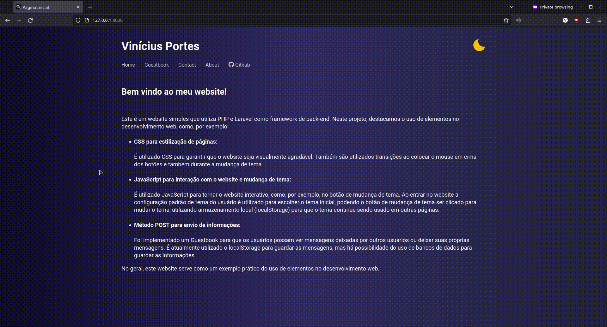

# site-pessoal

Bem vindo ao meu projeto de website pessoal!

## Descrição

Exemplo simples de website utilizando o framework Laravel. O site é um exemplo do uso de CSS para estilização de páginas, JavaScript para interação com o website, método POST e uso de Database para guardar e mostrar as mensagens dos usuários!

## Instalação

Necessário ter instalado Php, Composer e alguma database (mysql, mariadb, etc)
```bash
git clone https://github.com/vportes/site-pessoal.git
cd site-pessoal
composer install
cp .env.example .env
```
Crie uma [database](https://dev.mysql.com/doc/refman/8.0/en/database-use.html) caso não tenha ainda.

Modifique o arquivo ".env". Preencha as linhas "APP_URL", "DB_DATABASE", "DB_USERNAME" e "DB_PASSWORD" corretamente.

```bash
php artisan serve
```

## Preview


